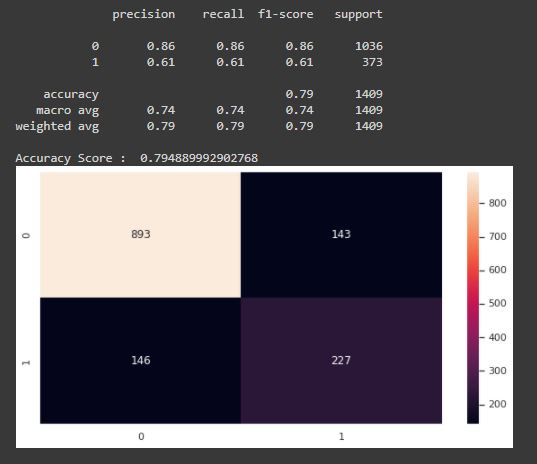

# Telecom-Customer-Churn-Prediction

 

## Business Objectives:

The objective of the project is to create a machine learning model. We are doing a supervised learning and our aim is to do predict customer churn.

Churn quantifies the number of customers who have unsubscribed or canceled their service contract. Customers turning their back to your service or product are no fun for any business. It is very expensive to win them back once lost, not even thinking that they will not do the best word to mouth marketing if unsatisfied.

The basic layer for predicting future customer churn is data from the past. We look at data from customers that already have churned (response) and their characteristics / behaviour (predictors) before the churn happened.

In our case the objective is reducing customer churn by identifying potential churn candidates beforehand, and take proactive actions to make them stay.

## Data Collection:

The dataset is obtained from Kaggle. 

Link: https://www.kaggle.com/blastchar/telco-customer-churn

## Modelling:

The analysis and model creation can be found in the .ipynb file. 

## Result:

The performance comparison is given below:

The performance of best Model which Random Forest Classifier is given below:

## Conclusion:

Out of various classification algorithms, Random Forest tend to gives most balanced performance with:
1.   Accuracy Score = 79%
2.   Precision = 61%
3.   Recall = 61%
4.   F1 Score = 61%
5.   AUC = 0.86

